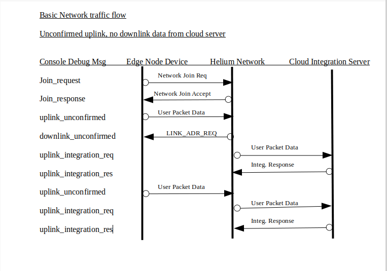

The process of joining the Helium network can seem to be fickle at times. There are several factors to keep in mind
##### Credentials
Helium only supports OTAA joins at this time. This means your edge node device application must be provisioned with the the proper LoRaWan credentials as found within the device configuration view within the Console. These includes
```
- Device EUI
- App EUI
- App Key
```

#### NOTE: These "must" be added to your device sketch in the proper byte vs string format as well as with the proper Endian-ness. These can and do vary from one edge node device LoRaWan runtime implementation to the next.
Visit the follow Wikipedia page for a comprehensive discussion of endianness https://en.wikipedia.org/wiki/Endianness

##### Distance to Nearest Hotspot
While LoRaWan is advertised as a long distance communications protocol there are many factors that can limit connectivity. The primary being unubstructed line of sight. Trees, buildings, mountains can limit the reach of your devices.
If there is any distance at all between your edge node device and the nearest hot spot and you are having trouble joining the network. It is suggested you take a field trip to get closer to the target hot spot to see if connection can be made when in close proximity.
Most runtime implementations will vary the data rate used for joining to try to compenstate for hot spot distance. The specific algorithm is highly implementation dependent.
 
 ##### Edge node device LoRaWan runtime join retry implementation
 Each runtime implementation of the LoRaWan specification is going to be different. Some runtimes will continuously try to join the network until power is removed. Some may provide an API or global variable which determines the number of join attempts to make before either pausing before retrying, aborting the join retry with notification sent to the device application via a callback mechanism, or aborting retry without notifying the device application (which is really not acceptable).
 

### 2. Helium Console Activities

Now that basic communications between the edge node device and the Helium network has been confirmed there are a few things one can do within the Helium Console product that you should be aware of when implementing your own custom device application.


#### Console Decoder Function

The LoRaWan specification encourages minimal over the air data packet transmissions. It is 
expected that the edge node device will implement a data packing scheme so as to reduce the overall size of the data packet that is transmitted over the air.
However, the compacted data would then need to be converted back to a more useable form at some point before it can be processed by the cloud integration server. This re-exapansion or conversion can be done as the data passes through the Helium Console or once received by the cloud integration server.


If one chooses to perform the re-expansion via the Helium Console functionality this is accomplished by implementing a Console decoder function written in javascript. Refer to the Helium documentation here https://docs.helium.com/use-the-network/console/functions/#decoder-function-output  for details concerning implementing this decoder function.

The supplied Helium sample device applications may include a very simple decoding javascript function as the sample itself sends very simple data. There is a repository of commonly used decoders that one can either use as is or use as a reference when developing a custom decoding scheme. The repository is community provide so feel free to contribute your custom decoder.
The repository can be found at: https://github.com/helium/console-decoders.

NOTE: The user data packet is encoded using a base64 format when being sent over the air. The data presented to the Console decoder function has been base64 decoded for you. If one waits and decodes at the cloud integration server that packet data is still base64 encoded thus you will need to base64 decode the packet  before re-expansion at the server.


#### Helium Console device debug view

Often it is helpful to be able to visually see the data flows that occur between the edge node device and the cloud integration server. The Helium Console provides a method for viewing  packet data as well as other associated meta-data as the packets flow through the Console. Due to security considerations the 
data is not automatically stored, nor is the presentation of the data started without a specific user action.
The usage of the Console debug view is documented here: https://docs.helium.com/use-the-network/console/debug/
The debug view can be very helpful when trying to diagnose communications issues.

  
  
  #### Network Data Flow
  The following diagram illustrates one possible communication flow from an edge node device, through the Helium Console and on to the integration server.
  Note: the ordering of the data flows as seen within the Console device debug view may not eactly match those seen in the illustration below.
  
  

  
  ## Editor Note:
  We should add the flow for confirmed messages, downlinks, ADR 
  
##  Misc Info for a "Intro to LoRaWan Doc
  LoRAWan settings: 
The following document is in answer to a member's off line query about typical device app LoRaWan configuration settings. (Not that there is a typical that cover all boards.)  I think we cover those absolutely required within the "examples" in the doc set, but not the optionals. Feel free to PM me some additions. I'm not sure where it will go in the docs.


As usual this my current understanding, corrections are of course welcome

 Typical LoRaWan device configuration settings for North America US915

Each board support package within the IDE exposes a different set of configuration variables. Some may be exposed at the IDE level while others are exposed via global varaiable within the device application sketch and still others may be hard coded within the runtime.

The acutal configuration variables supported by a given board/runtime will vary depending on the implementation.


 These below are for the Heltec CubeCell runtime only.
 Until you are familiar with their configuration behavior it is recommended you set the board options as follows:

 Via Arduino IDE: 
 ```
Select Tools -> LORAWAN_REGION: -> REGION_US915
Select Tools -> LORAWAN_CLASS: -> CLASS_A
Select Tools -> LORAWAN_NETMODE: -> OTTA
Select Tools -> LORAWAN_ADR: -> OFF
Select Tools -> LORAWAN_UPLINKMODE: -> UNCONFIRMED
Select Tools -> LORAWAN_Net_Reservation: -> OFF
Select Tools -> LORAWAN_AT_SUPPORT: -> OFF
Select Tools -> LORAWAN_AT_RGB : -> ACTIVE
Select Tools -> LoRaWan_ Debug Level : -> FREQ&&DIO (for most verbose messages)
```
Within PlatformIO platformio.ini file:
```
board_build.arduino.lorawan.region = US915
board_build.arduino.lorawan.class = CLASS_A
board_build.arduino.lorawan.netmode = OTAA
board_build.arduino.lorawan.adr = OFF
board_build.arduino.lorawan.uplinkmode = UNCONFIRMED
;board_build.arduino.lorawan.uplinkmode = CONFIRMED
board_build.arduino.lorawan.net_reserve = OFF
board_build.arduino.lorawan.at_support = OFF
; ACTIVE or DEACTIVE
board_build.arduino.lorawan.rgb = DEACTIVE
; NONE, FREQ, FREQ_AND_DIO
board_build.arduino.lorawan.debug_level = FREQ_AND_DIO
```

### Typical LoRaWan Configuration Settings for Region US915
| Name               |  US915 Value    | Description                                                               |
|:-------------------|:----------------|:--------------------------------------------------------------------------|
| Region             | US915           | (US915/EU868/CN470/etc) LoRaWan Region designation                        |
| Confirm Message    | Unconfirmed     | (Confirmed/UnConfirmed) - determines if each uplink message is confirmed by the network             |
| Class              | A               | (A/B/C) - LoRaWan Communication Class                                       |
| Activation         | OTAA            | (OTAA/ABP) OTAA - Over the Air Activation or ABP - Authentication By Personalisation |
| Adaptive Data Rate | OFF             | (ON/OFF) - Automatic data rate changes depending on radio reception                  |


### 1. A word about join failures

Misc:

Other important configurations that are set either via global variable or runtime API: (again it varies by implementation)

Sub Band and/or userChannelsMask[] are used to limit the channels used when communicating to the Helium network. These prevent the runtime from trying to use all 64 LoRaWan channels when Helium only supports a few.
```
Some runtimes use:
/*LoraWan channelsmask, default channels 0-7*/
uint16_t userChannelsMask[6]={ 0xFF00,0x0000,0x0000,0x0000,0x0000,0x0000 };


Some runtimes use:
XXX_setSubBandChannels(2);   // XXX_ varies by runtime
```

Some runtimes set the proper default for Helium Region US915


