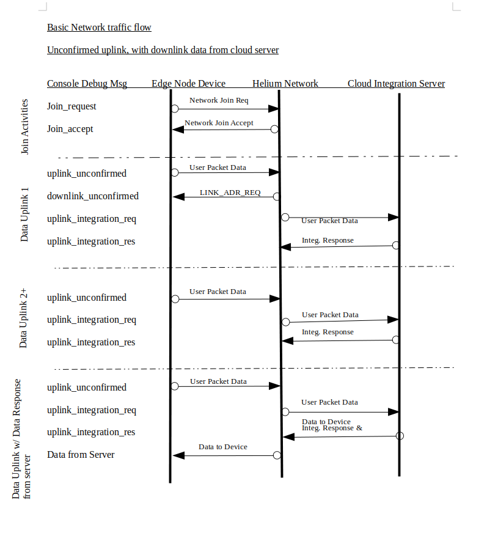

### Helium Network Troubleshooting Guide
This document is intended to help diagnose issues connecting to and using the Helium network. As the network and it's various components are seeing constant development and enhancements some of this information may be out of date.
Please open an issue if you notice something that needs to be corrected.
This document is a work in progress (occasionally).


- [Having Trouble Connecting to Helium?](#having-trouble-connecting-to-helium)
- [A word about join failures](#a-word-about-join-failures)
- [Successful Join](#successful-join)
- [Helium Console Activities](#helium-console-activities)
- [Console Decoder Function](#console-decoder-function)
- [Helium Console device debug view](#helium-console-device-debug-view)
- [Decoding Network MAC commands](#decoding-network-mac-commands)
- [Network Data Flow](#network-data-flow)
- [The data flow to and from device and Helium console](#the-data-flow-to-and-from-device-and-helium-console)
- [Typical LoRaWan Settings](#typical-lorawan-settings)
- [LoRaWan Subband](#lorawan-subband)
- [Downlink Shows Larger Packet Size Than Expected](#downlink-shows-larger-packet-size-than-expected)
- [Data Rate and Spreading factor after Join](#data-rate-and-spreading-factor-after-join)
- [LoRaWan Packet Decoder](#lorawan-packet-decoder)
- [Troubleshooting Missing Downlink Messages](#troubleshooting-missing-downlink-messages)
- [Arduino IDE Boards Manager Issue](#arduino-ide-boards-manager-issue)


### Having Trouble Connecting to Helium?
Details such as these will help the community help you get on track
- edge node device or gateway ( please list make/model of device)
- what LoRaWan region are you targeting
- what have you done, point to specific document if you followed one  
    * Look for a Helium doc for your device (https://docs.helium.com/use-the-network/devices)
- what is your development operating system (Windows/Linux)  - could make a difference, probably not
- what is your IDE (Arduino/PlatformIO/Eclipse/Keil/STMCube32/...)
- give a pointer to the script your using ( delete your console credentials first though)
- have you enabled debug logging at the device, what does it show
- have you enabled console side device debug view, what does it show. (https://docs.helium.com/use-the-network/console/debug/#using-the-debug-tool)
- what exactly do you see happening, not happening

### A word about join failures

The process of joining the Helium network can seem to be fickle at times. This is probably the hardest piece of the LoRaWan communications stream to debug as you have limited exposure to what is happening. There are several factors to keep in mind
#### Credentials
Helium only supports OTAA joins at this time. This means your edge node device application must be provisioned with the the proper LoRaWan credentials as found within the device configuration view within the Console. These includes
```
- Device EUI
- App EUI
- App Key
```

#### NOTE: These "must" be added to your device sketch in the proper byte vs string format as well as with the proper Endian-ness. These can and do vary from one edge node device LoRaWan runtime implementation to the next. Your device will not join the network if these are not exactly correct.
Visit the follow Wikipedia page for a comprehensive discussion of endianness https://en.wikipedia.org/wiki/Endianness

#### LoRaWan Configuration Parameters
There are a few parameters that must be configured properly not only for the join process to success but for further communications as well. These are detailed further in their own section [here](#LoRaWan_Configuration_Variables).  
For joins we need to pay particular attention to LoRaWan Region, Claas (Class A only) and Activation Mode(OTAA only), LoRaWan subband: should be 2 for best join possibiity.
What these are specifically named and how they are set varies from one LoRaWan runtime implementation to another.

#### Distance to Nearest Hotspot
While LoRaWan is advertised as a long distance communications protocol there are many factors that can limit connectivity. The primary being unubstructed line of sight. Trees, buildings, mountains can limit the reach of your devices.
If there is any distance at all between your edge node device and the nearest hot spot and you are having trouble joining the network. It is suggested you take a field trip to get closer to the target hot spot to see if connection can be made when in close proximity.
Most runtime implementations will vary the data rate and perhaps power level used for joining in order to try to compenstate for hot spot distance. The specific algorithm and effectiveness is highly LoRaWan runtime implementation dependent. For the North American region it is common to use a spreading factor of 10 ( SF10 - equates to DR_0) along with occasional randome use of SF7 (DR_3) or SF8 (DR_4) tossed in. As alot of this, it's runtime implementation dependent.

 ### Edge node device LoRaWan runtime join retry implementation
In general when your device tries to join the network if an initial join fails the runtime will attempt retries.
Each runtime implementation of the LoRaWan specification may handle join retries in a different manner as this is not detailed by the specification.
* Some runtimes will continuously try to join the network until power is removed.
* Some may provide an API or global variable which determines the number of join attempts to make
* Some may when exhausting the retry count  
    * pausing before retrying
    * aborting the join retry with notification sent to the device application via a callback mechanism
    * or aborting retry without notifying the device application (which is really not acceptable).
 
### Successful Join
An indication of a successful join is generally provided via a target device debug message dumped to the serial debug port, if attached and active, via an led indication of the device application if programmed to provide it, or via the Helium Console device debug view documented here: https://docs.helium.com/use-the-network/console/debug/  

After the join has succedded the normal device uplink messages can be sent. Beware however of the time on air limitation of the LoRaWan specification. You cannot and most runtimes will not let you continuus transmit over the air. The time constraints are Region specific. Trying to send message too fast may result in lost messages and interruption of the timing windows required for the device to receive downlink messages from the network.

### Helium Console Activities

Now that basic communications between the edge node device and the Helium network has been confirmed there are a few things one can do within the Helium Console product that you should be aware of when implementing your own custom device application.


### Console Decoder Function

The LoRaWan specification encourages minimal over the air data packet transmissions. It is 
expected that the edge node device will implement a data packing scheme so as to reduce the overall size of the data packet that is transmitted over the air.
However, the compacted data would then need to be converted back to a more useable form at some point before it can be processed by the cloud integration server. This re-exapansion or conversion can be done as the data passes through the Helium Console or once received by the cloud integration server.


If one chooses to perform the re-expansion via the Helium Console functionality this is accomplished by implementing a Console decoder function written in javascript. Refer to the Helium documentation here https://docs.helium.com/use-the-network/console/functions/#decoder-function-output  for details concerning implementing this decoder function.

The supplied Helium sample device applications may include a very simple decoding javascript function as the sample itself sends very simple data. There is a repository of commonly used decoders that one can either use as is or use as a reference when developing a custom decoding scheme. The repository is community provide so feel free to contribute your custom decoder.
The repository can be found at: https://github.com/helium/console-decoders.

NOTE: The user data packet is encoded using a base64 format when being sent over the air. The data presented to the Console decoder function has been base64 decoded for you. If one waits and decodes at the cloud integration server that packet data is still base64 encoded thus you will need to base64 decode the packet  before re-expansion at the server.

#### Adding a try/catch mechanism to your decoder
During decoder development it is sometimes helpful to implement javascript try/catch mechanisms with your decoders in order to catch unforseen errors. One example might be: 
```
var myMsg = {};

function Decoder(bytes, port) { 
   try{
     foo = bar;
     myMsg.err = ret;
   } catch (err) {
    return 'Decoder: ' + err.name + " : " + err.message;; 
   }
}
```
with the above try/catch in place you get the following message when testing the function with the function "Script Validator"  
```
"Decoder: ReferenceError : bar is not defined"
``` 

With out the try catch in place 
```
Your function threw an exception
```
As you can see your debugging effort might benefit from using a try/catch mechanism within your decoder.


### Helium Console device debug view

Often it is helpful to be able to visually see the data flows that occur between the edge node device and the cloud integration server. The Helium Console provides a method for viewing  packet data as well as other associated meta-data as the packets flow through the Console. Due to security considerations the 
data is not automatically stored, nor is the presentation of the data started without a specific user action.
The usage of the Console debug view is documented here: https://docs.helium.com/use-the-network/console/debug/
The debug view can be very helpful when trying to diagnose communications issues.

### Decoding Network MAC commands
In addition to the device application data packet uplink and downlink messages we on occasion see additional MAC command data being trasnferred along with the application data. If you see a transmission that contains more data in the packet than expected chances are the packet contains network MAC commands. The MAC commands are interpreted by the device LoRaWan runtime and are not forwarded on to the device appication.
The following online packet decoder can be used to extract the MAC commands but it still is not entirely in a human readable form. 
The decoder found [here](https://lorawan-packet-decoder-0ta6puiniaut.runkit.sh/)
Below you will find some documents that can help to interpret the bits exposed by the packet decoder

[RF Wireless World](https://www.rfwireless-world.com/Tutorials/LoRaWAN-MAC-layer-inside.html)  
[LoRaWan Spec](https://lora-alliance.org/wp-content/uploads/2020/11/lorawan1.0.3.pdf)

NOTE: There has been recent work by the Helium console dev team to expose the MAC commands and their meanings within the device debug view. Once that's fully implemented hopefully we will not need to use the above decoder.

 
### Network Data Flow
  The following diagram illustrates one possible communication flow from an edge node device, through the Helium Console and on to the integration server.
  Note: the ordering of the data flows as seen within the Console device debug view may not eactly match those seen in the illustration below.

This next diagram illustrates the data flow when sending unconfirmed uplink messages.
  
  


This next diagram illustrates the data flow when sending confirmed uplink messages.
  
  
### The data flow to and from device and Helium console
   device->hot spot -> router -> console  
   console -> router -> hot spot -> device

  ## Editor Note:
  We should add the flow for confirmed messages, downlinks, ADR 
  
### Typical LoRaWan Settings
  LoRAWan settings: 
The following is an answer to a member's off line query about typical device app LoRaWan configuration settings. (Not that there is a typical that cover all boards.)  I think we cover those absolutely required within the "examples" in the doc set, but not the optionals. 


As usual this my current understanding, corrections are of course welcome

#### LoRaWan Configuration variables<a name="LoRaWan_Configuration_Variables"></a>

Each board support package within the IDE exposes a different set of configuration variables. Some may be exposed at the IDE level while others are exposed via global varaiable within the device application sketch and still others may be hard coded within the runtime.

The acutal configuration variables supported by a given board/runtime will vary depending on the implementation.


 These below are for the Heltec CubeCell runtime only.
 Until you are familiar with their configuration behavior it is recommended you set the board options as follows:

 Via Arduino IDE: 
 ```
Select Tools -> LORAWAN_REGION: -> REGION_US915
Select Tools -> LORAWAN_CLASS: -> CLASS_A
Select Tools -> LORAWAN_NETMODE: -> OTTA
Select Tools -> LORAWAN_ADR: -> OFF
Select Tools -> LORAWAN_UPLINKMODE: -> UNCONFIRMED
Select Tools -> LORAWAN_Net_Reservation: -> OFF
Select Tools -> LORAWAN_AT_SUPPORT: -> OFF
Select Tools -> LORAWAN_AT_RGB : -> ACTIVE
Select Tools -> LoRaWan_ Debug Level : -> FREQ&&DIO (for most verbose messages)
```
Within PlatformIO platformio.ini file:
```
board_build.arduino.lorawan.region = US915
board_build.arduino.lorawan.class = CLASS_A
board_build.arduino.lorawan.netmode = OTAA
board_build.arduino.lorawan.adr = OFF
board_build.arduino.lorawan.uplinkmode = UNCONFIRMED
;board_build.arduino.lorawan.uplinkmode = CONFIRMED
board_build.arduino.lorawan.net_reserve = OFF
board_build.arduino.lorawan.at_support = OFF
; ACTIVE or DEACTIVE
board_build.arduino.lorawan.rgb = DEACTIVE
; NONE, FREQ, FREQ_AND_DIO
board_build.arduino.lorawan.debug_level = FREQ_AND_DIO
```

#### Typical LoRaWan Configuration Settings for Region US915 (North America)
| Name               |  US915 Value    | Description                                                               |
|:-------------------|:----------------|:--------------------------------------------------------------------------|
| Region             | US915           | (US915/EU868/CN470/etc) LoRaWan Region designation                        |
| Confirm Message    | Unconfirmed     | (Confirmed/UnConfirmed) - determines if each uplink message is confirmed by the network             |
| Class              | A               | (A/B/C) - LoRaWan Communication Class                                       |
| Activation         | OTAA            | (OTAA/ABP) OTAA - Over the Air Activation or ABP - Authentication By Personalisation |
| Adaptive Data Rate | OFF             | (ON/OFF) - Automatic data rate changes depending on radio reception                  |


Misc:

Other important configurations that are set either via global variable or runtime API: (again it varies by implementation)

#### LoRaWan Subband
The runtimes definition of sub band, also known as channel mask or usersChannelsMask is used to inform the runtime of specific frequency channels that should be used for optimal communications with the network.  
For instance the LoRaWan specificiation calls out the use of 64 frequency bands that could be used when attempting the intial join. Helium as well as other providers have chosen to limit the number of frequencies supported to one sub band or 8 frequencies.  
Unless we inform the runtime of this fact it will attempt to use all 64 channels in a random fashion. Thus it may take many retries before a supported frequency is attempted thus causing at times an unacceptable delay in makeing that initial join.

Once a join has succeeded and an intial uplink has been received by the Helium network, the network will respond with a downlink message targeting the runtime to inform it of the proper channel mask to use. Defining it up front can greatly reduce iniital join time.

```
Some runtimes use:
/*LoraWan channelsmask, default channels 0-7*/
uint16_t userChannelsMask[6]={ 0xFF00,0x0000,0x0000,0x0000,0x0000,0x0000 };


Some runtimes use:
XXX_setSubBandChannels(2);   // XXX_ varies by runtime
```

Some runtimes set the proper default for Helium Region US915

### Downlink Shows Larger Packet Size Than Expected
#### Question
Hi, I just tried sending a 6-byte downlink command to a device.. used the console downlink tool to send it and used the "Bytes" option and entered the bytes in base64 format. 

When it was queued, the payload size was 6 bytes as expected, but when it was actually sent, the payload size suddenly was 29 bytes and when I decoded the base64 payload, I couldn't recognize any of the hex bytes in there.

I guess the main question is: Should the payload be exactly the same as when it was queued or did the code somehow append more data or re-encode it somehow to make it a much larger size?.. what actual bytes would the device "see" when it gets the request?

Details:

Original data: 20 21 22 23 24 25 .. sent this base64 string from console tool: ICEiIyQl

Actual payload (base64) that was sent:
  "payload": "oBYCAEgKAQADAAAAcAMAAP8AZD8OTdJujpivgIY=",
  "payload_size": 29,

 .. which translates to raw hex of: a0 16 02 00 48 0a 01 00 03 00 00 00 70 03 00 00 ff 00 64 3f 0e 4d d2 6e 8e 98 af 80 86(edited)

#### Answer
The down links will sometimes contain Mac data along with user data. Generally it's the first downlink after the first uplink after an initial join. 
It contains Channel designation suggestion, data rate and power settings echo back.
You'll see that in the console and it will be delivered to your device runtime so you may see in with the device debug logs, however, the runtime will strip that MAC data out and deliver to your application via the callback, only the user data you expect.

That initial message needs to be acknowledged by your device run time. If it's not the network will continue to send it. So are you seeing just the one down link with the large payload or multiple.?


If you have ADR enabled you will see another larger payload downlink after about 20 or so uplinks, I think it's 20. That's the network sending another MAC or perhaps more than one, to suggestion to the runtime more efficient data rate/spreading factor and power setting based on received signal data.

Your user payload should be at the tail end of the raw payload whether it contains MAC data or not. It is however still encrypted when in the raw. It will be decrypted before being delivered to your device application.

If you're really interested in the raw payload: you can use a packet decoder at https://lorawan-packet-decoder-0ta6puiniaut.runkit.sh

### Data Rate and Spreading factor after Join
Once a network join has succeeded, what data rate is used when sending user data up to the network (uplink)?
That depends.

At least a "few" of the runtimes investigated seem to use the data rate (also related to Spreading Factor) that is defined by either:
* a runtime globally defined value
* a device application override of that global value, via "#define" or setting the global variable
* a device application override via an API call

#### If ADR (Adaptive Data Rate) is disabled,
If ADR is not enabled the runtime will use this data rate for subsequent uplinks. 
NOTE: each data rate has a maximum user packet size allowed for that data rate, what happens if you exceed that data rate?
* the runtime may return an error code when calling the send API
* the runtime may call a callback
* the runtime may just fail to send, silently  

Thus it is very important to understand the packet size implecations.

#### If ADR (Adaptive Data Rate) is enabled
At this point in the specifications life the data rate used after a successful join with ADR enabled is device runtime imlementation dependent. Best that can be assumed is that in the beginning either a default of DR_0 was used or the data rate used for a successful join, which in most cases was DR_0.  

Subsequent iterrations of runtimes as well as the Semtech reference platform seem to be migrating to using either the runtimes default data data rate or that specified by the device application via a variable or API call. However, not all runtimes will honor the device applicaiton specified rate. It is worth investigating to see what your runtime will do in this case.

All runtimes "should", with ADR enabled, attempt to adapt the data rate and or power settints for most optimal communications at some point in time. The Helium network will gather statistics from 20 sucessful uplinks before returning a downlink MAC message to the runtime suggesting changes. One may see one or more consecutive messages conveying the information to the runtime.

NOTE: As far as we know the device application is "not" notified of runtime data rate changes. And not all runtimes will expose the runtimes current data rate setting. This makes it very problematic if a device application has a packet size requirement larger that the lowest data rate (DR_0) allows.  
If a device application with ADR enabled requires a larger packet size than a data rate that may be suggested by the network ADR mechanism what happens?
* typically the device application may not be able to query the runtime for a current value, thus cannot dynamically modify packet size
* if the device application packet size is too large, the send API will fail, perhaps silently (implementation dependent)
    * the device runtime "might" return a send API fail status that contains an error code that "could" be used to decern a too larger of packet is being attempted. It's not clear at this time if this is a viable strategy. 


### LoRaWan Packet Decoder
[Decode base64 payload packet](https://lorawan-packet-decoder-0ta6puiniaut.runkit.sh/)

At times it may be beneficial to look inside a LoRaWan packet, look into the network MAC commands that come across with our packets but are stripped out by the runtimes before the packet is forwarded on to the end node device application. This decoder will allow you to do that. Note however, the output is still very cryptic. You really need a copy of the spec in order to "understand" the MAC command. Your payload data will be there as well, but alas, it's still encrypted. Its the device runtimes job to decrypt the user data.

### Troubleshooting Missing Downlink Messages

#### There could be a few reasons for missing downlinks
- your device is out of good reception range. I have seen with a Cubecell where transmits to the network make it ok, but reception from the network is not. It was a small window seen while mapping. As I move out of range the transmits to make it, the receptions from do not.
- the device is receiving the downlink but is not acting on it.  Perhaps this message is not interpreted correctly or feed back is missing. In other words some problem at the device side
- the downlink sent timing is off such that the device is not receiving it when it expects to. Could be the device side receive window or the network side transmit side send window timing is not correct
- The device is sending the uplink, but the network does not receive it or is seeing some sort of error preventing the down link from being sent
- The network is having an issue 
 
#### So what to do? 
- make sure you are well within range of the hot spot you are connecting with, at least for testing purposes.
- Check the console device debug view for errors within the uplink and downlink JSON
- if you have queued downlink messages the next should be sent after the next uplink. You will be able to see that and it's content in the debug view.
- is the down link just not sent, queue count unchanged? Or is it sent but not received by the device
- check the reported SNR/RSSI of the uplink messages. Is there a difference between them when the down link is delivered vs when it's not?
- enable all debug message within your device debug output. The runtimes may have some additional #defines to enable more debug info if you are building your own app. If it's a preinstalled app device you will need to find a way to dump debug data at the device side. You want to determine if the device is receiving and operating on the downlink.

The data flow  device->hot spot -> router -> console
                           console -> router -> hot spot -> device
so there are a couple of spots where the downlink could get lost.

If you get no where with info from the community either from here or console Gather up all the info you can and open an issue. github.com/helium/console or github.com/helium/router. Either should work, the team will route to the proper place. 

### Arduino IDE Boards Manager Issue
We have seen instances of the Arduino IDE reporting .json file download failures when opening up the Arduino Boards manager panel.
Here is an example from the Heltec forum:  http://community.heltec.cn/t/wifi-lora-32-v2-json-config-wont-load-for-arduino-ide/3003
This is not normally an issue if the IDE has already downloaded the .json file, however it can be a show stopper if the IDE is trying to do the initial download of the .json file.
If this is the case one can manually copy the file:
* browse to the .json file location
* copy the .json content
* paste it into the same .json file name in the arduino15 directory. Might be ~/.arduino15, might be
* You will probably still see the Download error message, but the manager should be able to  find your package.
